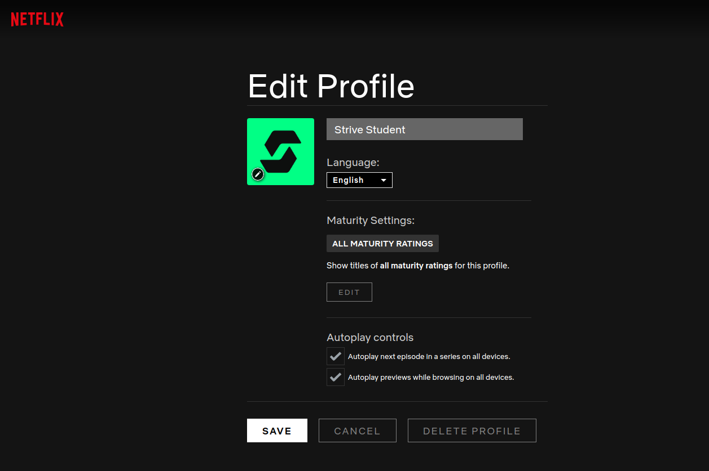
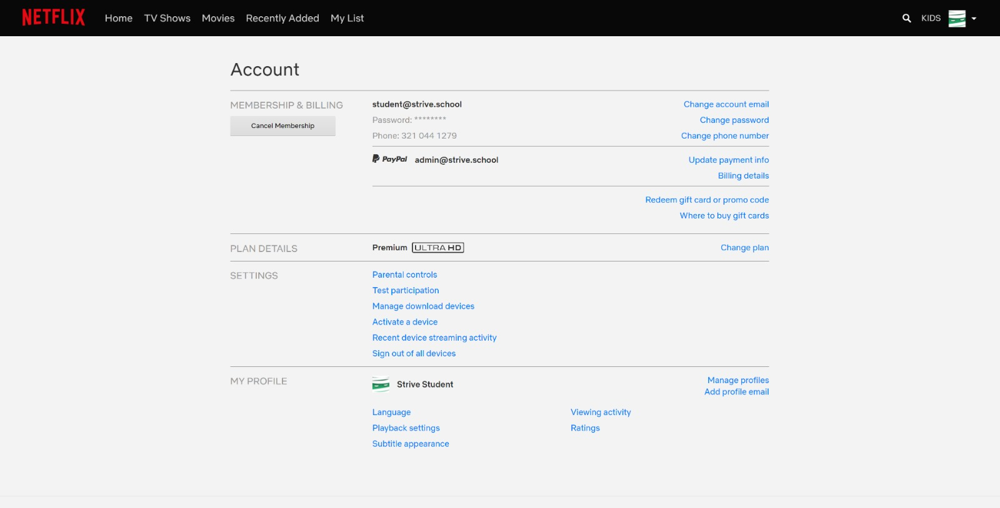

# Epicode-W6D5
## Netflix Clone Project

Dovrai replicare un'applicazione famosa in tutte le sue parti, utilizzando Bootstrap e i suoi componenti per ottenere un risultato responsive e fedele al riferimento visivo.

## Descrizione del Progetto

Ti verranno fornite immagini delle pagine che dovrai costruire.

### Punti Chiave

- Utilizzare Bootstrap per gestire griglie, gutter e allineamenti in modo efficace.
- Prestare particolare attenzione alla responsività dell'applicazione.
- Implementare le pagine seguendo il layout e lo stile del riferimento fornito.
- L'uso di SASS non è obbligatorio, ma è possibile utilizzarlo se aiuta senza aggiungere complessità eccessiva al progetto.
## Mockups

